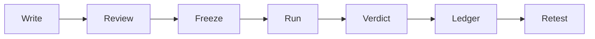
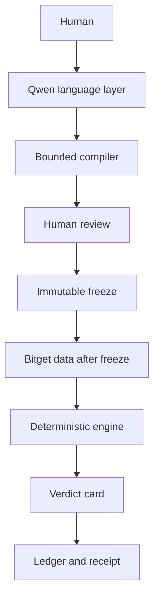
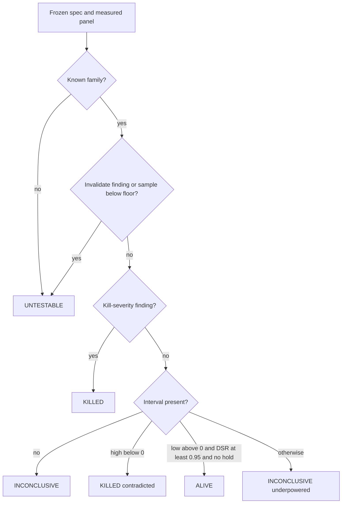
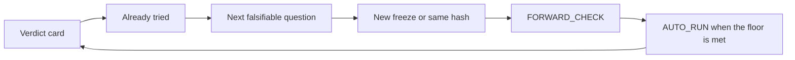
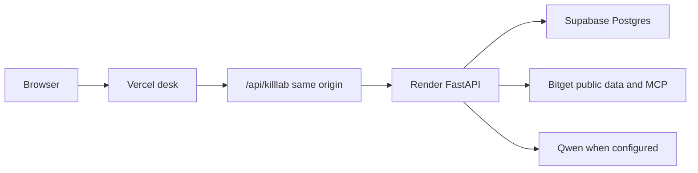

# KillLab

[](https://github.com/mohamedwael201193/KillLab/actions/workflows/ci.yml)
[](https://killlab.vercel.app)
[](LICENSE)
[](backend/pyproject.toml)
[](https://www.bitget.com/activity-hub/hackathon)

A trader writes a hypothesis. KillLab freezes it, then a deterministic engine tries to falsify it on Bitget data.

Qwen compiles language into a bounded test. It does not calculate the verdict. Track 3, AI Trading Desk, Review and Self-Evolution.

**Live demo:** [https://killlab.vercel.app](https://killlab.vercel.app)

> Write the sentence. Freeze the spec. Let the engine name the trap.

Engine `killlab-0.13.1`. The CI badge tracks `.github/workflows/ci.yml` on `main`. It is green only after that workflow succeeds.

## Why KillLab exists

A language model can write a convincing trading answer without proving the thesis. The dangerous part is not the prose. It is a number that was never frozen, never walked forward, and never charged a cost.

KillLab turns one hypothesis into a research record:

1. The human states the idea.
2. The compiler drafts a bounded specification.
3. The human reviews every field.
4. Freeze seals the specification.
5. Only then does market data enter.
6. The engine returns one of four verdicts, with the trap and the sample that produced it.

## The core loop



| Step | What can change | What cannot |
| --- | --- | --- |
| Write | The sentence | Nothing is scored yet |
| Review | Instruments, family, window, variants, kill floor | No venue history is loaded |
| Freeze | Nothing | SHA-256 of the canonical spec. A database trigger rejects update and delete |
| Run | A new snapshot for that same hash | The frozen spec and its hash |
| Verdict | Nothing on the card | Label, interval, DSR, units, and trap come from the engine |
| Ledger | The next question | Past stages stay timestamped |
| Retest | A new hypothesis, or the same hash on a later day | The old freeze is not edited to fit the new data |

## Who is allowed to do what



The model may draft a specification and explain a card. The compiler rejects metric keys such as Sharpe, DSR, PBO, PnL, sample size, and verdict. The engine is the only writer of those numbers. A frozen row cannot be rewritten to match a later result.

The refusal is structural, not a prompt hope. `FORBIDDEN_KEYS` in `backend/killlab/ai/boundary.py` is `sharpe`, `dsr`, `pbo`, `bps`, `pnl`, `n`, `verdict`, and `avoided_loss_bps`. The draft model uses `extra="forbid"`. A narration check rejects a number the engine did not return. `selection.split` is forced to `IS` before the pull. Costs are overwritten by the server schedule.

```text
hypothesis text
    -> Qwen JSON draft
    -> reject forbidden keys
    -> human review
    -> SHA-256 freeze
    -> Bitget pull
    -> walk-forward, bootstrap, DSR, PBO when the shape allows
    -> decide()
    -> receipt
```

## What the engine actually does

Confirmed in `killlab-0.13.1`:

| Piece | Role |
| --- | --- |
| Pre-registration | The spec is hashed before the pull. `killlab.test_specs` raises `frozen spec is immutable` on update or delete |
| Decision units | Each family has a floor. A short sample is `UNTESTABLE`, not a kill |
| Walk-forward | Expanding train and test ids. They must not overlap |
| Bootstrap | Percentile interval over the out-of-sample units, 400 resamples in the runner |
| Deflated Sharpe | Computed from the out-of-sample series and the trial count |
| PBO | CSCV runs only when there are at least 16 out-of-sample rows and at least 2 variants. Otherwise `pbo` stays null with a reason |
| Trial accounting | Variant count plus prior and related trials feeds the Deflated Sharpe trial count |
| Baseline | Family baselines are part of the frozen spec. Carry uses Earn USDT and BTC/ETH carry. Other scored families use buy-and-hold |
| Costs | The server writes the versioned taker schedule. The model does not supply the cost number used in the score |
| Four verdicts | `KILLED`, `ALIVE`, `INCONCLUSIVE`, `UNTESTABLE` |
| Provenance | Each context item keeps `source_class` and `failure_class` |
| Forward checks | A daily sweep can write `FORWARD_CHECK` on the same hash. `AUTO_RUN` is written when a previously short spec later reaches its floor. Neither edits the freeze |
| Receipt | `GET /v1/runs/{id}/receipt` copies hashes, engine version, label, trap, units, source classes, and ledger ids. It does not copy the thesis or a raw reply |

Research families and floors:

| Family | Minimum units |
| --- | --- |
| `session_timing` | 60 |
| `event_earnings` | 100 |
| `carry_basis` | 60 |
| `execution_venue_time` | 8 |
| `basis_convergence` | 60 |
| `lead_lag` | 60 |
| `macro_regime` | 60 |

`unsupported` is not a scored family. It returns `UNTESTABLE`.

Registered detectors called by `scan()`: multiple testing, beta-as-alpha, bar timing, wrong horizon, leakage, venue history, effect erase, wrong cost baseline, forward book, waiting risk. PBO is a metric, not one of those detectors. Published landing cards are failure-mode explanations. They are not the registry.

## Verdict semantics



| Label | It means | It does not mean |
| --- | --- | --- |
| `KILLED` | A kill-severity finding fired, or the interval sits entirely below zero | The idea is foolish in every future window. A new question needs a new freeze |
| `ALIVE` | The sample cleared the floor, the interval sits above zero, and Deflated Sharpe cleared 0.95, with no hold finding | A trade recommendation. The human still decides |
| `INCONCLUSIVE` | The sample was large enough to score, and the interval or the Deflated Sharpe still covers both an edge and no edge | A soft kill, and not a pass |
| `UNTESTABLE` | The family is unsupported, a finding invalidates the test, or the unit count is below the floor | The hypothesis was disproved |

The kill floor checked in code is an out-of-sample mean above 0, an out-of-sample Sharpe of at least 1, an out-of-sample to in-sample ratio of at least 0.5, Deflated Sharpe of at least 0.95, and an in-sample selection split. Missing data stays missing. The book capture is forward-recorded. `historical` is false, and it cannot score a past execution claim.

## A real production result

Desk run on 2026-09-30, engine `killlab-0.13.1`. These figures are the engine card, not a narration.

| Field | Value |
| --- | --- |
| Label | `KILLED` |
| Primary trap | `contradicted` |
| Units | 117 of 60 required |
| Detectable edge | 8.196 bps |
| Mechanism | `daily_basis_fade_versus_cash` |
| Family | `basis_convergence` |
| Freeze hash prefix | `e9d65f4e555fb356` |
| Run | `3bb70f91-4ccd-404e-9629-a477ac236a7c` |
| Receipt hash prefix | `7c287df086b0` |
| Engine on the receipt | `killlab-0.13.1` |

Context on that card did not change the verdict. Official news was `official_signal_mcp` / `empty_result`. A CoinDesk RSS row was `authoritative_fallback` / `valid_data`. The order book was forward-recorded, not a historical book.

The same freeze hash was used by earlier runs that also returned `KILLED` / `contradicted` / 117 units. Same spec, new snapshot, same label. That is reproducibility of the frozen question, not a promise about a different question.

## Evidence and provenance

Source classes stay distinct:

| Class | What it is |
| --- | --- |
| `official_signal_mcp` | Official Bitget Signal research tools |
| Official Bitget data MCP | `agent.bitget.com/mcp` queries such as a current US-stock quote |
| `bitget_public_rest` | Bitget public REST, including candles pulled after freeze |
| `authoritative_fallback` | A named public source used when the official tool is empty or errors, such as a dated RSS or NY Fed print |

`failure_class` is separate. `empty_result` means the tool answered and had no articles. `feed_error_all` means every named feed returned an error. `valid_data` means the payload was usable as context. Context is attached with `usable_for_verdict` false unless the engine actually scored it. A series that names another venue is not relabeled as Bitget tape.

## Self-evolution



| Record | What it is |
| --- | --- |
| Already tried | Up to 12 earlier runs with the same fingerprint, or a related spec |
| `REVIEW` | A pasted fill compared with the unit interval. KillLab does not place the order |
| Next question | Language only. It names what is still open. It does not edit `result_json` |
| `FORWARD_CHECK` | A later look at the same hash, marked automatic, often still short of the floor |
| `AUTO_RUN` | The same hash, run when the family floor is reached. Not a new family and not a rewritten spec |

This is not model self-modification and not autonomous learning. The weights do not update. The ledger stores what was asked, what was frozen, and what the engine returned.

On 2026-09-30 the forward list showed a `FORWARD_CHECK` for that UTC day at 20 units, 80 still short, plus two `AUTO_RUN` rows from 2026-09-29: one `INCONCLUSIVE` and one `KILLED`.

## Bitget and Qwen

| Integration | Role |
| --- | --- |
| Qwen `qwen3.8-max` | First compiler and narrator when `LLM_API_KEY` is set. Base URL default `https://hackathon.bitgetops.com/v1`. Language only |
| Temporary provider | Used only if the Qwen key is empty. Still cannot emit a verdict number. The manual spec path remains valid |
| Official Signal MCP | Research skills. Recipes that return no articles stay `empty_result` |
| Official data MCP | Current quotes and similar reads at `https://agent.bitget.com/mcp` |
| Bitget public REST | Candles and public market reads after freeze. `https://api.bitget.com` |
| Authoritative fallback | Dated public series when the official tool does not return the history |

There is no order, transfer, withdraw, or cancel client in the backend.

## Production architecture



The browser calls only `https://killlab.vercel.app/api/killlab/...`. The Next.js route adds the bearer token on the server. The API is `https://killlab-api.onrender.com`. Health is `GET /health` and returns `engine_version`.

| Path | Owns |
| --- | --- |
| `backend/killlab/engine/verdict.py` | The four labels |
| `backend/killlab/engine/traps.py` | Floors and the ten detectors |
| `backend/killlab/runner.py` | Walk-forward, bootstrap, DSR, conditional PBO |
| `backend/killlab/ai/compile.py` | Provider order. Qwen first when `LLM_API_KEY` is set |
| `backend/killlab/receipt.py` | The public receipt body and its hash |
| `FRONTEND/src/app/api/killlab/[...path]/route.ts` | Same-origin proxy |
| `docs/calibration/verdict_curve.json` | Planted session curve for `killlab-0.13.1` |

## How to run locally

Prerequisites: Python 3.12 or newer, Node.js 20 or newer, and a Postgres database. Public research does not need a Bitget private API key. A Qwen key is optional. Without it, compilation uses the manual spec path or a temporary provider you configure yourself.

```bash
git clone https://github.com/mohamedwael201193/KillLab.git
cd KillLab
cp .env.example .env
cp FRONTEND/.env.example FRONTEND/.env.local
```

Fill `DATABASE_URL`, `DIRECT_URL`, and `KILLAB_API_TOKEN` in `.env`. Generate the token locally. Do not paste a production secret into a public note. Point `FRONTEND/.env.local` at the local API:

```bash
BACKEND_PUBLIC_URL=http://127.0.0.1:8000
KILLAB_API_TOKEN=<the same token as in .env>
```

Backend:

```bash
cd backend
python -m pip install -e ".[dev]"
alembic upgrade head
python -m uvicorn killlab.api:app --host 127.0.0.1 --port 8000
```

Health:

```bash
curl http://127.0.0.1:8000/health
```

A healthy process returns `{"status":"ok","db":"ok","engine_version":"killlab-0.13.1"}`.

Frontend, in another shell:

```bash
cd FRONTEND
npm install
npm run dev
```

Open [http://127.0.0.1:3000](http://127.0.0.1:3000).

Offline tests, from `backend`:

```bash
python -m pytest -q -m "not live"
```

`python -m pytest -q --collect-only` reports **102** tests. One is marked `live` and requests a public NVDA candle. The other **101** do not need network access. Oracle checks live in `backend/tests/test_oracle.py`. The planted session curve is `docs/calibration/verdict_curve.json` for engine `killlab-0.13.1`: `false_alive_on_zero_edge` is false and `false_kill_on_40bps` is false on seeds 11 through 15. That file is a calibration fixture, not a live trading result.

Frontend checks, from `FRONTEND`:

```bash
node --experimental-strip-types src/lib/research/draft-spec.test.ts
node --experimental-strip-types src/lib/research/present-verdict.test.ts
node --experimental-strip-types src/lib/desk/run-status.test.ts
npx tsc --noEmit
npm run build
```

There are three frontend assertion scripts, not a second pytest suite. This repository has no smart contracts, so there is no contract count.

## How judges can verify it

### Five-minute checklist

1. Open [https://killlab.vercel.app](https://killlab.vercel.app). The hero states the loop and shows 102 engine tests, 7 families, 4 verdicts, and engine 0.13.1.
2. Choose **Open the desk**. Pick **Positioning proxy** or write your own sentence. Nothing is loaded yet.
3. **Draft the test**. Review shows the family and instruments. Data is not loaded.
4. Hold **Freeze**. The hash is shown. The run screen waits on the run endpoint. It does not advance on a timer.
5. Read the verdict. Label, primary trap, units, detectable edge, and engine version are on the card. Context rows show `source_class`.
6. Open **Already tried** and **Download receipt**. The receipt includes `engine_version`, `primary_trap`, and `receipt_sha256`. It does not include a bearer token.
7. Open **Ledger**. Stages are `KNOWN`, `UNKNOWN`, `RESULT`, `DECISION`, and, when recorded, `REVIEW`, `FORWARD_CHECK`, `AUTO_RUN`. Times are server timestamps.
8. In the browser network panel, requests stay on `killlab.vercel.app`.

### Local path

After the commands above, repeat steps 2 through 7 on `http://127.0.0.1:3000`. Local runs use your database and your token. The public demo uses the deployed database. A local freeze will not match the production run id above unless you are pointed at that database, which you should not do with a copied production secret.

| Surface | Live demo | Local |
| --- | --- | --- |
| Desk UI | Vercel | `npm run dev` |
| API and engine | Render `killlab-0.13.1` | Uvicorn on port 8000 |
| Token | Added by `/api/killlab`, not visible to the page | Same proxy, token only in `FRONTEND/.env.local` |
| Market data | Bitget public endpoints after freeze | Same, from your machine |
| Qwen | Used when the deployed key is set | Used only if you set `LLM_API_KEY` |

## Testing and verification

| Check | Current evidence |
| --- | --- |
| Python tests | 102 collected. 1 is marked `live`. 5 in `test_api.py` need Postgres and a post-freeze Bitget pull |
| CI | `.github/workflows/ci.yml` runs `pytest -m "not live" --ignore=tests/test_api.py` (96 passed locally on 2026-09-30), then `tsc` and `npm run build` |
| Frontend scripts | 3 assertion files under `FRONTEND/src` |
| Typecheck and build | `npx tsc --noEmit`, `npm run build` |
| Oracle | `test_oracle.py` plus `docs/calibration/verdict_curve.json` |
| Production smoke | `GET /health` returns `killlab-0.13.1`. The 2026-09-30 positioning-proxy card above was read in Chrome on the deployed desk |

Verified here means that check was run or that production response was read. It does not mean every historical Chrome path was replayed for this document.

## Security and safety

- The browser never receives `KILLAB_API_TOKEN`. `FRONTEND/src/app/api/killlab/[...path]/route.ts` attaches `Authorization` on the server.
- Desk traffic is same-origin `/api/killlab`.
- The backend has no order, transfer, withdraw, or cancel client.
- Frozen specs are protected by a Postgres trigger.
- The receipt drops thesis text and raw tool replies. A reply is stored only as a hash.
- Verdict numbers are `engine_computed`. Narration is checked so the model cannot insert a number the engine did not return.

## Design principles

- Evidence over persuasion.
- Freeze before data.
- The model interprets. The engine computes.
- Missing data stays missing.
- The human makes the final trading decision.

## FAQ

**Does ALIVE mean I should trade?** No. It means this frozen test cleared its own floor. Fills, if you paste them, are reviewed against that interval. KillLab does not send an order.

**Why is a short sample not KILLED?** Because absence of evidence is not a contradiction. The label is `UNTESTABLE` with `insufficient_units`.

**Can I edit a freeze after I see the result?** No. The database rejects the write. A different question is a new spec and a new hash.

**What if Qwen is down?** The manual specification path still runs. A temporary language provider, if you configured one, still cannot write DSR, PBO, the interval, or the label.

**Where do the landing numbers come from?** 102 is `pytest --collect-only` on `backend/tests`. Seven families are the scored keys in `FAMILY_MIN_UNITS`. Four verdicts are the labels in `decide()`. `0.13.1` is `ENGINE_VERSION`.

## License

MIT. See [LICENSE](LICENSE). The engine, desk, and this document are covered. Market data stays with its provider. A verdict is a research record, not investment advice, and not a promise of profit.

## Links

- Live demo: [https://killlab.vercel.app](https://killlab.vercel.app)
- Repository: [https://github.com/mohamedwael201193/KillLab](https://github.com/mohamedwael201193/KillLab)
- Hackathon: [https://www.bitget.com/activity-hub/hackathon](https://www.bitget.com/activity-hub/hackathon)
- Handbook: [https://bitget-ai.gitbook.io/bitgetai_hackathons2](https://bitget-ai.gitbook.io/bitgetai_hackathons2)
- Agent Hub: [https://www.bitget.com/docs/uta/agent-hub](https://www.bitget.com/docs/uta/agent-hub)
- Agent Hub repository: [https://github.com/Bitget-AI/agent_hub](https://github.com/Bitget-AI/agent_hub)
- Bitget Signal: [https://github.com/Bitget-AI/bitget-signal](https://github.com/Bitget-AI/bitget-signal)
- US-stock data MCP: [https://agent.bitget.com/mcp](https://agent.bitget.com/mcp)
